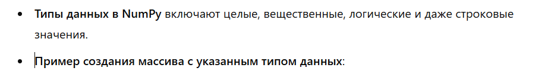

## Пример создания массива

```python
import numpy as np
arr = np.array([1, 2, 3, 4, 5])
print(arr)
```

## Преимущества NumPy


``` python
import time
size = 10**6
# Список Python
py_list = [i for i in range(size)]
start_time = time.time()
py_list = [i * 2 for i in py_list]
print(f"Python list took: {time.time() - start_time} seconds")

# Массив NumPy
np_array = np.arange(size)
start_time = time.time()
np_array = np_array * 2
print(f"NumPy array took: {time.time() - start_time} seconds")
```


## Создание массивов (ndarray)



``` python
arr = np.array([1, 2, 3], dtype=np.float32)
print(arr)
```

## Функции для создания массивов

`np.zeros` — создает массив, заполненный нулями.

``` python
zeros_array = np.zeros((2, 3))  # 2x3 массив, заполненный нулями
print(zeros_array)
```
`np.ones` — создает массив, заполненный единицами.

``` python
ones_array = np.ones((2, 3))  # 2x3 массив, заполненный единицами
print(ones_array)
```
`np.full` — создает массив, заполненный заданным значением.

``` python
full_array = np.full((2, 3), 7)  # 2x3 массив, заполненный числом 7
print(full_array)
```

## Создание массивов из существующих данных

`np.asarray` — преобразует список или кортеж в массив.

``` python
py_list = [1, 2, 3]
np_array = np.asarray(py_list)
print(np_array)
```

`np.fromiter` — создает массив из итерируемого объекта.

```python
iter_obj = iter([1, 2, 3])
np_array = np.fromiter(iter_obj, dtype=int)
print(np_array)
```

## Массивы в числовых диапазонах

``` python
range_array = np.arange(0, 10, 2)  # от 0 до 10 с шагом 2
print(range_array)
```

`np.linspace` — создает массив с равномерно распределенными значениями между двумя числами.

``` python
linspace_array = np.linspace(0, 10, 5)  # 5 значений от 0 до 10
print(linspace_array)
```

`np.logspace` — создает массив с равномерно распределенными значениями по логарифмической шкале.

```python
logspace_array = np.logspace(1, 3, 5)  # 5 значений от 10^1 до 10^3
print(logspace_array)
```