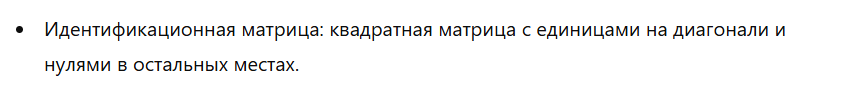

## Индексация и нарезка:

```python
import numpy as np

arr = np.array([10, 20, 30, 40, 50])

# Индексация
print(arr[0])  # Выведет: 10
print(arr[-1])  # Выведет: 50

# Нарезка (срез)
print(arr[1:4])  # Выведет: [20 30 40]
print(arr[:3])   # Выведет: [10 20 30]
print(arr[::2])  # Выведет: [10 30 50]
```

## Расширенное индексирование (маски):

```python
import numpy as np

arr = np.array([10, 20, 30, 40, 50])

# Использование маски
mask = arr > 20
print(arr[mask])  # Выведет: [30 40 50]

```

## Широковещательная передача (broadcasting):

``` python
import numpy as np

# Массивы разной формы
arr1 = np.array([1, 2, 3])
arr2 = np.array([10])

# Широковещательная передача: добавление к каждому элементу массива arr1 значение из arr2
result = arr1 + arr2
print(result)  # Выведет: [11 12 13]
```


## Создание идентификационной матрицы



``` python
identity_matrix = np.eye(3)
print(identity_matrix)
```

## Манипуляции с матрицами

``` python
a = np.array([[1, 2], [3, 4]])
b = np.array([[5, 6]])

# Горизонтальное объединение
hstack = np.hstack((a, b.T))
print(hstack)

# Вертикальное объединение
vstack = np.vstack((a, b))
print(vstack)
```

* Разделение

``` python
# Горизонтальное разделение
hsplit = np.hsplit(hstack, 2)
print(hsplit)
```

## Арифметические операции с матрицами

Поэлементные операции:

``` python
a = np.array([[1, 2], [3, 4]])
b = np.array([[5, 6], [7, 8]])

# Сложение
print(np.add(a, b))

# Вычитание
print(np.subtract(a, b))

# Поэлементное умножение
print(np.multiply(a, b))

```


* Матричное умножение:

``` python
print(np.dot(a, b))  # Матричное произведение
```


## Введение в линейную алгебру

Основные функции:

1. Ранг матрицы:

``` python
rank = np.linalg.matrix_rank(a)
print(rank)
```
2. Определитель:

``` python
determinant = np.linalg.det(a)
print(determinant)
```

3. Собственные значения и векторы:

``` python
eigenvalues, eigenvectors = np.linalg.eig(a)
print(eigenvalues)
print(eigenvectors)
```

## Решение линейных уравнений

``` python 
A = np.array([[2, 1], [1, 3]])
B = np.array([8, 18])

x = np.linalg.solve(A, B)
print(x)  # Решение системы
```